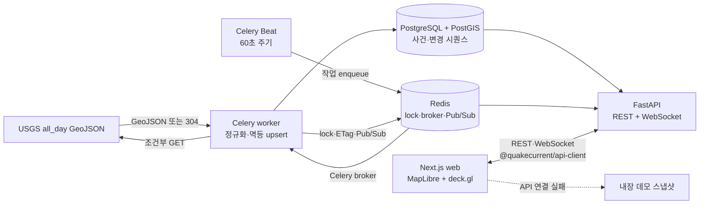

# QuakeCurrent 아키텍처

이 문서는 QuakeCurrent의 현재 시스템 경계와 데이터 흐름을 설명합니다. 제품 범위와
운영 상태는 [SSOT](./SSOT.md), 선택 이유와 재검토 조건은
[결정 기록](./DECISIONS.md)을 기준으로 합니다.

## 시스템 흐름



## 구성요소와 책임

| 구성요소 | 위치 | 책임 |
| --- | --- | --- |
| Web | `apps/web` | 라우트, URL 필터, 지도·목록·상세, 데모 fallback |
| API | `apps/api` | 수집, 저장, REST snapshot/detail/change, WebSocket |
| API client | `packages/api-client` | 생성 REST 타입, fetch client, WS schema·재연결 |
| PostgreSQL/PostGIS | Compose 서비스 | 사건, 지리 좌표, 수집 실행, 변경 시퀀스 |
| Redis | Compose 서비스 | Celery broker, 수집 lock, 조건부 요청 값, Pub/Sub |
| GitHub Actions | `.github/workflows/verify.yml` | 언어별 계약·테스트·빌드·브라우저 검증 |

PostgreSQL/PostGIS는 영속 데이터와 재연결 복구의 기준입니다. 현재 Compose의
Redis는 persistence를 끈 경량 전송·조율 계층이므로 사건 데이터의 SSOT가 아닙니다.

## 저장소 의존 방향

```text
apps/web
  → packages/api-client
  → HTTP·WebSocket 계약
  → apps/api
  → PostgreSQL/PostGIS, Redis, USGS
```

- 웹은 API의 Python 소스를 직접 import하지 않습니다.
- API client는 앱에서 재사용할 수 있는 언어 경계이며 웹 UI를 참조하지 않습니다.
- API는 웹 구현을 모르며 CORS와 WebSocket origin만 환경 설정으로 허용합니다.
- 루트 `package.json`은 명령을 조율하고, 실제 웹 의존성과 설정은 `apps/web`이
  소유합니다.
- Python API는 npm workspace가 아니라 uv로 관리하는 독립 애플리케이션입니다.

## 수집 흐름

1. Celery Beat가 `quakecurrent.ingest_usgs_all_day` 작업을 60초마다 예약합니다.
2. worker는 Redis lock을 즉시 획득합니다. 다른 수집이 실행 중이면 이번 작업을
   건너뜁니다.
3. 이전 `ETag`와 `Last-Modified`로 USGS에 조건부 요청을 보냅니다.
4. 응답이 `304`면 사건·변경 로그 쓰기와 Pub/Sub 신호를 생략하고 수집 실행 기록을
   `not_modified`로 종료합니다.
5. 새 응답은 크기 제한을 확인한 뒤 정규화합니다.
6. `source + external_id`를 기준으로 저장하며 내용이 달라진 사건만 변경 시퀀스를
   생성합니다.
7. DB transaction이 완료된 뒤 compact change signal을 Redis에 발행합니다.

## 웹 bootstrap과 실시간 흐름

1. 웹은 `GET /v1/events?limit=120`으로 초기 스냅샷과 `meta.sequence`를 받습니다.
2. API는 기본 설정의 30시간 조회 창에서 이 요청에 대해 최신순 최대 120건을
   반환하고, UI는 이를 다시 기본 24시간으로 필터링합니다. endpoint 자체의
   기본 limit은 250이고 최대 500까지 허용합니다.
3. TypeScript client는 해당 시퀀스 이후를 REST change endpoint로 먼저
   catch-up합니다.
4. 이어 `/v1/ws/events?after_seq=...`에 연결합니다.
5. WebSocket 서버는 Redis를 먼저 subscribe하고 DB에서 `after_seq` 이후 최대
   500개 신호를 catch-up합니다.
6. queued Pub/Sub 신호와 이후 live 신호를 같은 연결로 전달합니다.
7. client는 성공적으로 처리한 시퀀스만 진행하고 중복 시퀀스를 무시합니다.
8. 연결이 끊기면 REST change endpoint로 누락 구간을 복구한 뒤 마지막 시퀀스로
   재연결합니다.

WebSocket 메시지는 전체 사건이 아니라 다음 최소 정보만 전달합니다.

```text
seq + event_id + operation + updated_at
```

생성·수정 신호를 받으면 웹은 상세 REST 요청으로 최신 사건을 가져옵니다. client는
삭제 신호를 받으면 현재 목록에서 해당 사건을 제거할 수 있지만, 현재 수집 흐름은
삭제 신호를 생성하지 않습니다.

## 일관성 모델

- 수집은 멱등하지만 exactly-once 전달을 가정하지 않습니다.
- DB sequence는 단조 증가 cursor이며 빈틈없는 카운터가 아닙니다.
- 실시간 client는 at-least-once 신호를 허용하고 시퀀스로 중복을 제거합니다.
- 웹의 초기·현재 상태는 REST snapshot으로 만들고 WebSocket은 작은
  변경·무효화 신호로 사용합니다. 영속 원본은 PostgreSQL입니다.
- DB commit 이후에만 Redis 신호를 발행합니다.

## 실패와 복구

| 실패 | 현재 동작 |
| --- | --- |
| API bootstrap 실패 | 데모 스냅샷을 명시적으로 표시하고 15초 뒤 재시도 |
| WebSocket 중단 | 마지막 처리 시퀀스 이후 REST catch-up 후 재연결 |
| 중복 수집 | 55초 Redis lock으로 일반적인 중복 실행을 제한하고 획득 실패 작업은 건너뜀 |
| USGS 변경 없음 | 사건·변경 로그와 Pub/Sub은 생략하고 수집 실행을 `not_modified`로 기록 |
| USGS 요청·파싱 실패 | 기존 DB snapshot을 유지하고 run 생성 뒤 오류는 failed로 기록, Celery가 최대 3회 재시도 |
| DB 또는 Redis 준비 안 됨 | `/healthz`는 프로세스 생존만 알리고 `/readyz`가 `503` 반환 |
| WebGL 또는 basemap 실패 | 목록·상세는 유지하고 지도 영역에 오류 메시지 표시 |
| 생성 계약 drift | 로컬 명령과 CI가 파일명과 함께 실패 |

## 스타일과 렌더링 경계

- Next.js App Router가 route와 서버 렌더링 경계를 담당합니다.
- 지도는 client component로 지연 로드해 서버 렌더링 경계와 WebGL을 분리합니다.
- MapLibre는 basemap과 projection, deck.gl은 지진 halo·core·selection layer를
  담당합니다.
- Tailwind CSS 4는 PostCSS 기반 스타일 도구로 유지하되, 현재 화면 스타일은 전역
  token, 기능 CSS와 CSS Module로 소유권을 나눕니다.
- LINE Seed Sans KR은 한국어 UI, `ui-monospace`는 코드·시퀀스·수치와 영문
  메타 라벨에 사용합니다.

## 배포 경계

현재 배포 대상과 운영 인프라는 확정하지 않았습니다. Vinext/Vite worker adapter는
웹 빌드 경계 안에 있지만, 배포 설정·SLA·production telemetry는 현재 아키텍처의
검증 범위가 아닙니다. 저장소에는 현재 `.openai/hosting.json`도 없습니다. 배포를
결정할 때 다음을 별도 결정으로 기록합니다.

- 웹·API·worker·DB·Redis의 호스팅 조합
- 비밀값과 네트워크 경계
- migration·rollback 절차
- 로그·metric·alert와 비용 한도
- 실제 트래픽 기반 필터·실시간 구조 승격 여부

## 현재 한계

- UI가 받는 스냅샷은 최대 120건이므로 해당 시간대의 전 지구 사건 전체를 보장하지
  않습니다.
- 원천에서 사라진 사건을 삭제하거나 오래된 DB row를 정리하는 작업이 없습니다.
- 인증·권한·rate limiting이 없는 공개 read-only prototype 경계입니다.
- REST 응답에는 생성 TypeScript 타입을 사용하지만 runtime schema validation은
  없습니다.
- WebSocket server schema와 TypeScript guard는 수동으로 동기화하며 `seq=0`
  허용 범위에 알려진 차이가 있습니다.
- Redis Pub/Sub 유실은 다음 재연결에서 DB change log로 복구할 수 있지만, 연결
  중인 client의 즉시 누락 감지를 보장하지 않습니다.
- 수집 lock은 55초 lease를 자동 연장하지 않아 장시간 작업에서는 중첩 가능성이
  있습니다.
- CARTO raster basemap은 별도 외부 런타임 의존성입니다.
